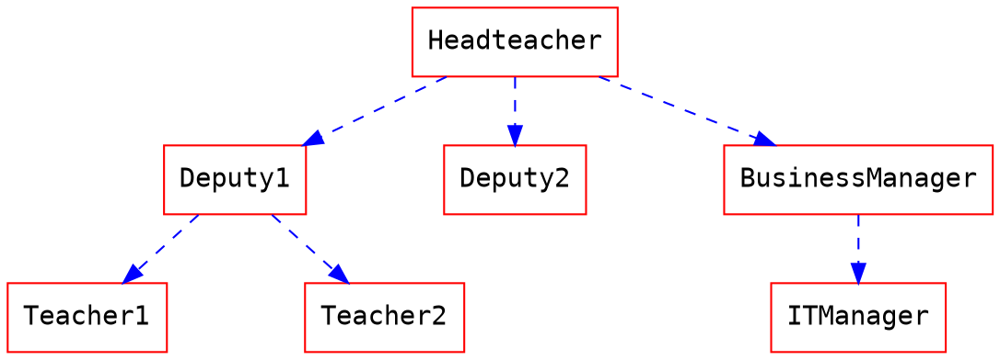

# Flow Charts

Алгоритм программы
```flow
st=>start: Start
e=>end: End
op=>operation: My Operation
op2=>operation: lalala
cond=>condition: Yes or No?

st->op->op2->cond
cond(yes)->e
cond(no)->op2
```

### Graphviz или иерархия


### Mermaid или диаграмма Ганта
```mermaid
gantt
    title A Gantt Diagram

    section Section
    A task           :a1, 2014-01-01, 30d
    Another task     :after a1  , 20d
    section Another
    Task in sec      :2014-01-12  , 12d
    anther task      : 24d